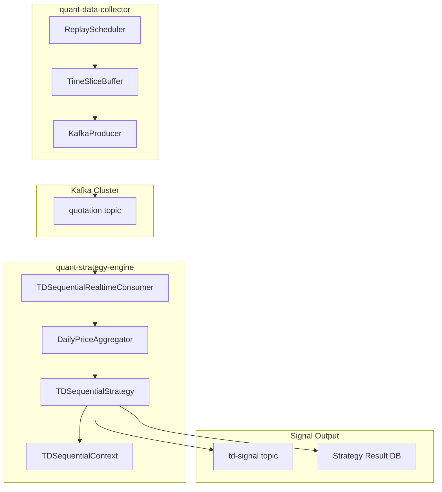
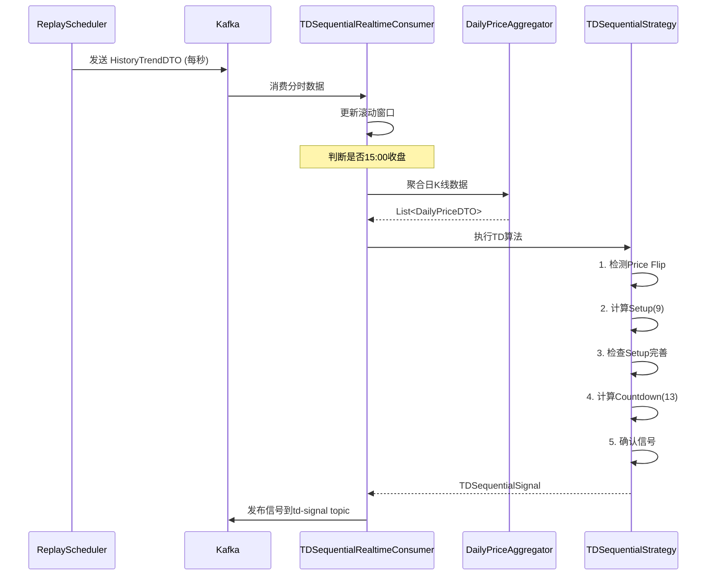

# TD Sequential (九转序列) Strategy Implementation Plan

## Overview

本方案旨在在您的 `quant-strategy-engine` 模块中实现 **TD Sequential (九转序列)** 信号型策略，并与现有的行情回放服务进行集成，支持实时计算与历史回测。

### 核心设计要点

1. **收盘价计算**：每个交易日的收盘价 = 当日 `HistoryTrendDTO` 中 `tradeDate` 最大时间戳对应的 `latestPrice`
2. **信号型策略**：作为 `QuantStrategy` 的实现类，遵循现有策略模式架构
3. **A股适配**：涨跌停过滤、严格不等式、红绿颜色反转等

---

## Proposed Changes

### Component 1: Common Module - Data Models

#### [NEW] [DailyPriceDTO.java](file:///E:/project/quant-nano-alpha/common/src/main/java/dto/DailyPriceDTO.java)

每日 OHLC 数据模型，用于 TD Sequential 计算：

```java
@Data
@Builder
public class DailyPriceDTO {
    private String windCode;
    private LocalDate tradeDate;
    private Double open;       // 开盘价
    private Double high;       // 最高价
    private Double low;        // 最低价  
    private Double close;      // 收盘价 (= 当日最后一条 latestPrice)
    private Double volume;     // 成交量
    private boolean isLimitUp;   // 涨停标志
    private boolean isLimitDown; // 跌停标志
}
```

---

#### [NEW] [TDSequentialSignal.java](file:///E:/project/quant-nano-alpha/common/src/main/java/dto/TDSequentialSignal.java)

TD Sequential 信号输出模型：

```java
@Data
@Builder
public class TDSequentialSignal {
    private String windCode;
    private LocalDate signalDate;
    
    // Setup 信号
    private SignalType setupType;      // BUY_SETUP / SELL_SETUP / NONE
    private int setupCount;            // 当前 Setup 计数 (1-9)
    private boolean isSetupPerfected;  // 是否完善
    
    // Countdown 信号
    private SignalType countdownType;  // BUY_COUNTDOWN / SELL_COUNTDOWN / NONE
    private int countdownCount;        // 当前 Countdown 计数 (1-13)
    private boolean isCountdownConfirmed; // 第13根是否确认
    
    // TDST 止损线
    private Double tdstSupportLine;    // 买入止损线
    private Double tdstResistanceLine; // 卖出止损线
    
    // 信号强度评分
    private Double signalScore;
    
    public enum SignalType {
        BUY_SETUP, SELL_SETUP, BUY_COUNTDOWN, SELL_COUNTDOWN, NONE
    }
}
```

---

#### [MODIFY] [StrategyMetaEnum.java](file:///E:/project/quant-nano-alpha/common/src/main/java/enums/strategy/StrategyMetaEnum.java)

添加九转序列策略枚举：

```diff
 // ===================== 信号型（Signal） =====================
 SIG_MOVING_AVERAGE("SIG_MA", "均线策略", StrategyType.SIGNAL, "基于短期与长期均线交叉判断买卖信号", 50, 200),
+SIG_TD_SEQUENTIAL("SIG_TD", "九转序列策略", StrategyType.SIGNAL, "基于TD Sequential识别趋势衰竭的反转策略", 30, 120),
 SIG_MEAN_REVERSION("SIG_MEAN", "均值回归策略", StrategyType.SIGNAL, "基于价格偏离均线程度的回归策略", 40, 180),
```

---

### Component 2: Strategy Engine - Core Implementation

#### [NEW] [TDSequentialStrategy.java](file:///E:/project/quant-nano-alpha/services/quant-strategy-engine/src/main/java/com/hao/strategyengine/strategy/impl/signal/TDSequentialStrategy.java)

核心策略实现类，主要结构如下：

```java
@Slf4j
@Component
public class TDSequentialStrategy implements QuantStrategy {

    // ================== 状态机枚举 ==================
    private enum TDState {
        IDLE,               // 空闲状态
        SETUP_IN_PROGRESS,  // Setup 计数中
        SETUP_COMPLETED,    // Setup 完成，等待 Countdown
        COUNTDOWN_IN_PROGRESS, // Countdown 计数中
        SIGNAL_GENERATED    // 信号生成
    }
    
    // ================== 核心方法 ==================
    
    /**
     * 1. Price Flip 检测 - 启动 Setup 的前置条件
     */
    private boolean detectPriceFlip(List<DailyPriceDTO> prices, int index, boolean forBuy);
    
    /**
     * 2. Setup 计数 (9根)
     * 买入Setup: Close_i < Close_{i-4} (严格小于)
     * 卖出Setup: Close_i > Close_{i-4} (严格大于)
     */
    private SetupResult calculateSetup(List<DailyPriceDTO> prices, int startIndex, boolean forBuy);
    
    /**
     * 3. Setup 完善机制
     * 买入完善: min(Low_8, Low_9) <= min(Low_6, Low_7)
     * 卖出完善: max(High_8, High_9) >= max(High_6, High_7)
     */
    private boolean isSetupPerfected(List<DailyPriceDTO> setupPrices, boolean forBuy);
    
    /**
     * 4. Countdown 计数 (13次，可非连续)
     * 买入Countdown: Close_j <= Low_{j-2}
     * 卖出Countdown: Close_j >= High_{j-2}
     */
    private CountdownResult calculateCountdown(List<DailyPriceDTO> prices, int startIndex, 
                                                SetupResult setup, boolean forBuy);
    
    /**
     * 5. Countdown 第13根确认
     * 买入确认: Low_13 <= Close_{Count8}
     * 卖出确认: High_13 >= Close_{Count8}
     */
    private boolean isCountdownConfirmed(List<DailyPriceDTO> prices, CountdownResult countdown);
    
    /**
     * 6. 状态机管理 - 中断/取消/循环
     */
    private void handleStateTransition(TDState currentState, ...);
    
    /**
     * 7. TDST 防线计算
     * 买入止损: Setup第一根K线的最低价
     * 卖出止损: Setup第一根K线的最高价
     */
    private Double calculateTDSTLine(List<DailyPriceDTO> setupPrices, boolean forBuy);
    
    /**
     * 8. 涨跌停过滤器 (A股适配)
     */
    private boolean isLimitFiltered(DailyPriceDTO price);
}
```

> [!IMPORTANT]
> **关键设计决策**: 使用**严格不等式** (`<` 而非 `<=`) 进行 Setup 计数，以过滤 A 股常见的横盘震荡噪音。

---

#### [NEW] [TDSequentialContext.java](file:///E:/project/quant-nano-alpha/services/quant-strategy-engine/src/main/java/com/hao/strategyengine/strategy/impl/signal/TDSequentialContext.java)

策略状态上下文，用于维护跨 K 线的计算状态：

```java
@Data
public class TDSequentialContext {
    private String windCode;
    private TDState currentState = TDState.IDLE;
    
    // Setup 相关
    private int setupCount = 0;
    private boolean isForBuy = true;  // true=买入Setup, false=卖出Setup
    private int setupStartIndex = -1;
    private List<DailyPriceDTO> setupPrices = new ArrayList<>();
    
    // Countdown 相关  
    private int countdownCount = 0;
    private List<Integer> countdownIndices = new ArrayList<>(); // 记录每次计数的索引
    private Double count8Close = null; // 用于第13根确认
    
    // TDST 相关
    private Double tdstLine = null;
    
    // 重置方法
    public void reset();
    public void resetSetup();
    public void resetCountdown();
}
```

---

#### [NEW] [DailyPriceAggregator.java](file:///E:/project/quant-nano-alpha/services/quant-strategy-engine/src/main/java/com/hao/strategyengine/strategy/impl/signal/DailyPriceAggregator.java)

从分时数据聚合日 K 线数据：

```java
@Component
public class DailyPriceAggregator {
    
    /**
     * 从 HistoryTrendDTO 列表聚合为 DailyPriceDTO
     * 
     * 收盘价规则: 每个交易日 tradeDate 范围内最大时间戳的 latestPrice
     */
    public List<DailyPriceDTO> aggregate(List<HistoryTrendDTO> trendData) {
        return trendData.stream()
            .collect(Collectors.groupingBy(
                dto -> dto.getTradeDate().toLocalDate(),
                LinkedHashMap::new,
                Collectors.toList()))
            .entrySet().stream()
            .map(entry -> {
                LocalDate date = entry.getKey();
                List<HistoryTrendDTO> dayData = entry.getValue();
                
                // 按时间排序，取最后一条作为收盘价
                dayData.sort(Comparator.comparing(HistoryTrendDTO::getTradeDate));
                HistoryTrendDTO lastTick = dayData.get(dayData.size() - 1);
                
                return DailyPriceDTO.builder()
                    .windCode(lastTick.getWindCode())
                    .tradeDate(date)
                    .open(dayData.get(0).getLatestPrice())
                    .high(dayData.stream().mapToDouble(HistoryTrendDTO::getLatestPrice).max().orElse(0))
                    .low(dayData.stream().mapToDouble(HistoryTrendDTO::getLatestPrice).min().orElse(0))
                    .close(lastTick.getLatestPrice())
                    .volume(lastTick.getTotalVolume())
                    .build();
            })
            .sorted(Comparator.comparing(DailyPriceDTO::getTradeDate))
            .collect(Collectors.toList());
    }
    
    /**
     * 检测涨跌停 (简化版: 涨跌幅超过9.5%视为涨跌停)
     */
    public void detectLimitStatus(List<DailyPriceDTO> dailyPrices) {
        for (int i = 1; i < dailyPrices.size(); i++) {
            DailyPriceDTO today = dailyPrices.get(i);
            DailyPriceDTO yesterday = dailyPrices.get(i - 1);
            double changePercent = (today.getClose() - yesterday.getClose()) / yesterday.getClose() * 100;
            
            today.setLimitUp(changePercent >= 9.5);
            today.setLimitDown(changePercent <= -9.5);
        }
    }
}
```

---

### Component 3: Real-time Integration with Market Replay

#### [NEW] [TDSequentialRealtimeConsumer.java](file:///E:/project/quant-nano-alpha/services/quant-strategy-engine/src/main/java/com/hao/strategyengine/integration/kafka/TDSequentialRealtimeConsumer.java)

实时消费行情回放数据，计算 TD Sequential 信号：

```java
@Slf4j
@Component
@RequiredArgsConstructor
public class TDSequentialRealtimeConsumer {

    private final DailyPriceAggregator aggregator;
    private final TDSequentialStrategy tdStrategy;
    
    // 滚动窗口: 保存最近30天的分时数据用于TD计算
    // Key: windCode, Value: 时间序列数据
    private final Map<String, Deque<HistoryTrendDTO>> dataWindow = new ConcurrentHashMap<>();
    
    private static final int WINDOW_SIZE_DAYS = 30; // 需要至少13+9天数据
    
    @KafkaListener(
        topics = "quotation",
        groupId = "td-sequential-group",
        containerFactory = "kafkaListenerContainerFactory"
    )
    public void consumeQuotation(String message, Acknowledgment ack) {
        try {
            HistoryTrendDTO tick = parseMessage(message);
            
            // 1. 更新滚动窗口
            updateDataWindow(tick);
            
            // 2. 检查是否为收盘时刻 (15:00)
            if (isMarketClose(tick.getTradeDate())) {
                // 3. 触发TD计算
                TDSequentialSignal signal = calculateTDSignal(tick.getWindCode());
                
                if (signal.getSetupCount() == 9 || signal.getCountdownCount() == 13) {
                    log.info("TD信号生成|TD_signal_generated,windCode={},setup={},countdown={}",
                        tick.getWindCode(), signal.getSetupCount(), signal.getCountdownCount());
                    // 4. 推送信号到下游 (可发送到专用Topic或写入DB)
                    publishSignal(signal);
                }
            }
            
            ack.acknowledge();
        } catch (Exception e) {
            log.error("TD消费处理异常|TD_consume_error", e);
        }
    }
    
    private void updateDataWindow(HistoryTrendDTO tick) {
        dataWindow.computeIfAbsent(tick.getWindCode(), k -> new LinkedList<>())
                  .addLast(tick);
        
        // 保持窗口大小，清理超过30天的旧数据
        Deque<HistoryTrendDTO> window = dataWindow.get(tick.getWindCode());
        while (window.size() > 0) {
            LocalDate oldest = window.peekFirst().getTradeDate().toLocalDate();
            LocalDate latest = tick.getTradeDate().toLocalDate();
            if (ChronoUnit.DAYS.between(oldest, latest) > WINDOW_SIZE_DAYS) {
                window.pollFirst();
            } else {
                break;
            }
        }
    }
}
```

---

### Component 4: Test Files

#### [NEW] [TDSequentialStrategyTest.java](file:///E:/project/quant-nano-alpha/services/quant-strategy-engine/src/test/java/com/hao/strategyengine/strategy/impl/signal/TDSequentialStrategyTest.java)

单元测试覆盖核心算法：

```java
@Slf4j
class TDSequentialStrategyTest {

    private TDSequentialStrategy strategy;
    private DailyPriceAggregator aggregator;

    @BeforeEach
    void setUp() {
        strategy = new TDSequentialStrategy();
        aggregator = new DailyPriceAggregator();
    }

    @Test
    @DisplayName("买入Setup完整计数测试 - 连续9日收盘价低于4日前")
    void testBuySetupComplete() {
        // 构造连续下跌9天的数据
        List<DailyPriceDTO> prices = generateDowntrendData(15);
        // 断言Setup完成
    }

    @Test
    @DisplayName("买入Setup中断测试 - 第5天不满足条件")
    void testBuySetupInterruption() {
        // 构造下跌4天后反弹的数据
        List<DailyPriceDTO> prices = generateInterruptedData();
        // 断言Setup被中断，计数归零
    }

    @Test
    @DisplayName("Setup完善机制测试")
    void testSetupPerfection() {
        // min(Low_8, Low_9) <= min(Low_6, Low_7)
    }

    @Test
    @DisplayName("Countdown非连续计数测试")
    void testCountdownNonConsecutive() {
        // Close_j <= Low_{j-2} 可非连续满足
    }

    @Test
    @DisplayName("涨跌停过滤测试 - 跌停日信号无效")
    void testLimitDownFilter() {
        // 第9根K线跌停时信号无效
    }

    @Test
    @DisplayName("TDST止损线计算测试")
    void testTDSTLineCalculation() {
        // 买入止损 = Setup第一根K线最低价
    }

    @Test
    @DisplayName("状态机循环测试 - 第二个同向Setup覆盖第一个")
    void testRecycling() {
        // Range_Setup2 >= 1.618 * Range_Setup1 时循环
    }
    
    // ================== 辅助方法 ==================
    private List<DailyPriceDTO> generateDowntrendData(int days) { ... }
    private List<DailyPriceDTO> generateInterruptedData() { ... }
}
```

---

## Architecture Diagram



---

## Data Flow



---

## Verification Plan

### Automated Tests

1. **单元测试运行命令**：
   ```powershell
   cd E:\project\quant-nano-alpha\services\quant-strategy-engine
   mvn test -Dtest=TDSequentialStrategyTest -DfailIfNoTests=false
   ```

2. **集成测试运行命令**：
   ```powershell
   cd E:\project\quant-nano-alpha
   mvn test -pl services/quant-strategy-engine -Dtest=TDSequentialIntegrationTest
   ```

### Manual Verification

1. **启动市场回放**：
   - 配置 `ReplayConfig` 的 `startDate` 和 `endDate`
   - 启动 `quant-data-collector` 服务
   - 观察 Kafka `quotation` topic 的消息

2. **验证信号生成**：
   - 启动 `quant-strategy-engine` 服务
   - 查看日志中 `TD信号生成|TD_signal_generated` 的输出
   - 验证 Setup=9 或 Countdown=13 时正确生成信号

3. **数据正确性验证**：
   - 使用已知历史数据（如某只股票的历史九转信号）对比算法输出
   - 建议选择交易软件中已标注九转信号的标的进行对比

---

## File Summary

| Action | File Path | Description |
|--------|-----------|-------------|
| NEW | `common/.../dto/DailyPriceDTO.java` | 日K线数据模型 |
| NEW | `common/.../dto/TDSequentialSignal.java` | TD信号输出模型 |
| MODIFY | `common/.../enums/strategy/StrategyMetaEnum.java` | 添加TD策略枚举 |
| NEW | `strategy-engine/.../signal/TDSequentialStrategy.java` | 核心策略实现 |
| NEW | `strategy-engine/.../signal/TDSequentialContext.java` | 策略状态上下文 |
| NEW | `strategy-engine/.../signal/DailyPriceAggregator.java` | 分时数据聚合器 |
| NEW | `strategy-engine/.../kafka/TDSequentialRealtimeConsumer.java` | 实时Kafka消费者 |
| NEW | `strategy-engine/src/test/.../TDSequentialStrategyTest.java` | 单元测试 |
