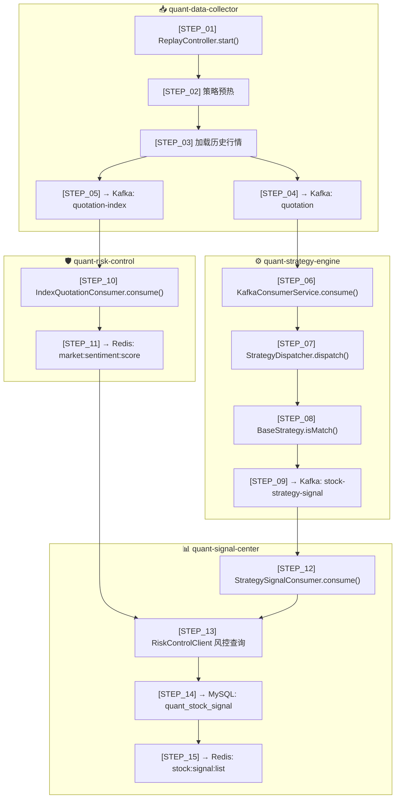

# 全链路数据流转说明

> 本文档描述从「行情回放」到「信号落库」的完整数据流转路径。  
> 在代码中搜索 `[FULL_CHAIN_STEP_xx]` 可快速定位到对应步骤。

---

## 🔄 全链路总览



---

## 📝 15 步详解

| 步骤 | 模块 | 类.方法 | 说明 |
|:----:|------|---------|------|
| **01** | data-collector | `ReplayController.start()` | HTTP 入口，启动回放 |
| **02** | data-collector | `ReplayScheduler.doReplay()` | 九转/MA 策略历史数据预热到 Redis |
| **03** | data-collector | `loadAllData()` | 从 MySQL 加载分时行情到内存 |
| **04** | data-collector | → Kafka `quotation` | 推送股票行情 → 策略引擎 |
| **05** | data-collector | → Kafka `quotation-index` | 推送指数行情 → 风控模块 |
| **06** | strategy-engine | `KafkaConsumerService.consume()` | 消费股票行情，解析 JSON |
| **07** | strategy-engine | `StrategyDispatcher.dispatch()` | 线程池并行分发给所有策略 |
| **08** | strategy-engine | `BaseStrategy.onSignalTriggered()` | 策略触发后构建信号 DTO |
| **09** | strategy-engine | `StrategySignalProducer.sendSignal()` | 发送信号 → Kafka |
| **10** | risk-control | `IndexQuotationConsumer.consume()` | 消费指数行情，更新内存价格 |
| **11** | risk-control | `pushScoreToRedis()` | 每秒计算情绪分数推送 Redis |
| **12** | signal-center | `StrategySignalConsumer.consume()` | 消费策略信号 |
| **13** | signal-center | `RiskControlClient.getMarketSentimentScoreWithFallback()` | 旁路查询风控分数（Sentinel 保护） |
| **14** | signal-center | `SignalPersistenceService.saveSignal()` | 追加落库 MySQL |
| **15** | signal-center | `SignalCacheService.updateSignalCache()` | 主动推送 Redis 缓存 |

---

## 🔍 快速定位代码

在 IDE 中全局搜索以下关键字：

```bash
# 搜索所有步骤
[FULL_CHAIN_STEP_

# 搜索特定步骤
[FULL_CHAIN_STEP_01]
[FULL_CHAIN_STEP_12]
```

---

## 📊 关键数据结构

### HistoryTrendDTO（行情）
```json
{
  "windCode": "600519.SH",
  "latestPrice": 1850.00,
  "tradeDate": "2026-01-01T10:30:00"
}
```

### StrategySignalDTO（策略信号）
```json
{
  "windCode": "600519.SH",
  "strategyId": "NINE_TURN_RED",
  "signalType": "BUY",
  "triggerPrice": 1850.00,
  "riskLevel": "MEDIUM"
}
```

### MarketSentimentDTO（风控分数）
```json
{
  "score": 72,
  "expireTimestamp": 1735718403000,
  "zoneName": "震荡偏强区"
}
```

---

## 🔗 链路追踪 (TraceId)

每条行情数据携带 `traceId` 字段（格式：`yyyyMMdd_HHmmss`），全链路透传：

```
HistoryTrendDTO.traceId → StrategySignalDTO.traceId → 日志输出
```

### 日志效果

```log
# data-collector (traceId 生成)
[STEP_04] Stock_sent,code=600519.SH,traceId=20260101_093000

# strategy-engine (traceId 透传)
[STEP_08] Signal_triggered,code=600519.SH

# signal-center (traceId 打印)
[TRACE:20260101_093000] Signal_processed,code=600519.SH,strategy=NINE_TURN_RED
```

### 问题排查

```bash
# 追踪特定时间点的完整链路
grep "20260101_093000" *.log
```

---

## 📚 相关文档

- [行情回放架构](./modules/data-collector/MarketReplayServiceArchitecture.md)
- [策略引擎设计](./modules/strategy-engine/)
- [风控模块说明](./modules/risk-control/)
