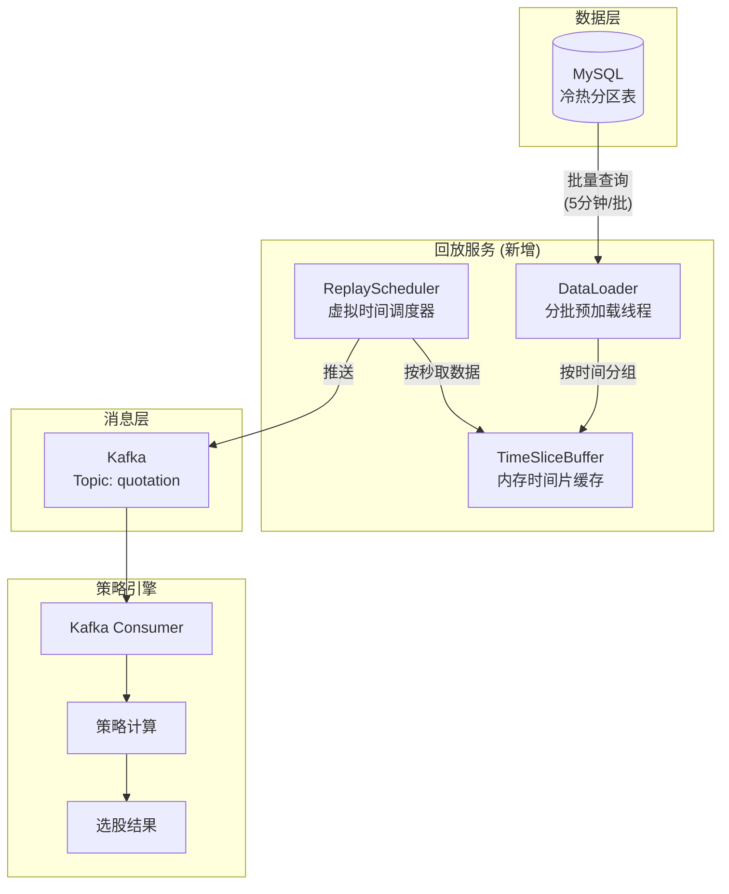

# Market Replay Service 行情回放服务架构方案

## 背景与需求

用户希望实现一个**量化选股回测/模拟系统**，通过历史分时数据模拟实时行情推送，使策略引擎能够基于"实时"数据流进行计算和选股。

### 核心需求
1. 按时间顺序回放历史行情数据
2. 支持调节回放速度（实时/加速）
3. 不要"每秒查数据库"，避免数据库负载过高
4. 使用 Kafka 作为行情分发通道

---

## 现有代码分析

### 已有基础设施
| 组件 | 位置 | 功能 |
|------|------|------|
| `DataProducerRunner` | `quant-data-collector` | 基础 Kafka 发送逻辑 |
| `KafkaProducerService` | `quant-data-collector` | 高性能批量发送 + IO 线程池 |
| `HistoryTrendDTO` | `quant-data-collector` | 行情 DTO，已使用 Double（性能友好） |
| `selectByWindCodeListAndDate` | `QuotationMapper` | 支持冷热表分区查询 |

### 当前不足
- 无时间控制的回放调度器
- 一次性加载所有数据，无分片预加载
- 无虚拟时间管理

---

## 架构设计



---

## 核心组件设计

### 1. ReplayConfig - 回放配置

```java
@Data
@Configuration
@ConfigurationProperties(prefix = "replay")
public class ReplayConfig {
    /** 回放起始日期 yyyyMMdd */
    private String startDate;
    /** 回放结束日期 yyyyMMdd */
    private String endDate;
    /** 回放速度倍数，1=实时，10=10倍速 */
    private int speedMultiplier = 1;
    /** 每次预加载的时间片长度(分钟) */
    private int preloadMinutes = 5;
    /** 是否启用回放模式 */
    private boolean enabled = false;
}
```

---

### 2. DataLoader - 数据预加载器

**职责**：批量从 MySQL 加载数据到内存

```java
@Slf4j
@Component
public class DataLoader {
    
    private final QuotationService quotationService;
    private final ReplayConfig config;
    
    /**
     * 加载指定时间段的行情数据
     * 复用现有的 selectByWindCodeListAndDate 方法
     */
    public List<HistoryTrendDTO> loadTimeSlice(LocalDateTime start, LocalDateTime end) {
        String startStr = start.format(COMPACT_FORMATTER);
        String endStr = end.format(COMPACT_FORMATTER);
        
        // 复用现有冷热表分离逻辑
        return quotationService.getHistoryTrendDataByStockList(
            startStr, 
            DateUtil.appendEndOfDayTime(endStr), 
            Collections.emptyList()  // 空列表 = 全市场
        );
    }
}
```

---

### 3. TimeSliceBuffer - 时间片缓存

**职责**：按秒组织行情数据，支持快速检索

```java
@Component
public class TimeSliceBuffer {
    
    // Key: 时间戳(秒), Value: 该秒所有股票的行情
    private final TreeMap<Long, List<HistoryTrendDTO>> timeSlices = new TreeMap<>();
    
    private final ReentrantReadWriteLock lock = new ReentrantReadWriteLock();
    
    /**
     * 批量加入数据，按时间分组
     */
    public void addBatch(List<HistoryTrendDTO> data) {
        // 按 tradeDate 的秒级时间戳分组
        Map<Long, List<HistoryTrendDTO>> grouped = data.stream()
            .collect(Collectors.groupingBy(
                dto -> dto.getTradeDate().toEpochSecond(ZoneOffset.of("+8"))
            ));
        
        lock.writeLock().lock();
        try {
            grouped.forEach((ts, list) -> 
                timeSlices.computeIfAbsent(ts, k -> new ArrayList<>()).addAll(list)
            );
        } finally {
            lock.writeLock().unlock();
        }
    }
    
    /**
     * 获取并移除指定时间戳的数据
     */
    public List<HistoryTrendDTO> pollSlice(long timestamp) {
        lock.writeLock().lock();
        try {
            return timeSlices.remove(timestamp);
        } finally {
            lock.writeLock().unlock();
        }
    }
    
    /**
     * 获取缓冲区最早的时间戳
     */
    public Long getEarliestTimestamp() {
        lock.readLock().lock();
        try {
            return timeSlices.isEmpty() ? null : timeSlices.firstKey();
        } finally {
            lock.readLock().unlock();
        }
    }
}
```

---

### 4. ReplayScheduler - 核心调度器

**职责**：维护虚拟时钟，按节奏推送数据

```java
@Slf4j
@Component
public class ReplayScheduler {
    
    private final DataLoader dataLoader;
    private final TimeSliceBuffer buffer;
    private final KafkaProducerService kafkaProducer;
    private final ReplayConfig config;
    
    // 虚拟时间（模拟的当前时间）
    private volatile long virtualTime;
    
    // 预加载游标
    private LocalDateTime preloadCursor;
    
    @Async("ioTaskExecutor")
    public void startReplay() {
        if (!config.isEnabled()) {
            log.info("回放模式未启用");
            return;
        }
        
        // 初始化
        LocalDateTime start = parseDate(config.getStartDate());
        LocalDateTime end = parseDate(config.getEndDate());
        virtualTime = start.toEpochSecond(ZoneOffset.of("+8"));
        preloadCursor = start;
        
        // 启动预加载线程
        startPreloader(end);
        
        // 主回放循环
        long endTimestamp = end.toEpochSecond(ZoneOffset.of("+8"));
        while (virtualTime <= endTimestamp) {
            // 1. 从缓冲区获取当前秒的数据
            List<HistoryTrendDTO> batch = buffer.pollSlice(virtualTime);
            
            // 2. 发送到 Kafka
            if (batch != null && !batch.isEmpty()) {
                sendToKafka(batch);
                log.debug("回放推送|Replay_push,time={},count={}", 
                    Instant.ofEpochSecond(virtualTime), batch.size());
            }
            
            // 3. 休眠（根据速度倍数调整）
            sleepForReplay();
            
            // 4. 虚拟时间推进 1 秒
            virtualTime += 1;
        }
        
        log.info("回放完成|Replay_finished");
    }
    
    private void sleepForReplay() {
        long sleepMs = 1000 / config.getSpeedMultiplier();
        if (sleepMs > 0) {
            try {
                Thread.sleep(sleepMs);
            } catch (InterruptedException e) {
                Thread.currentThread().interrupt();
            }
        }
    }
    
    private void startPreloader(LocalDateTime endDate) {
        // 异步预加载线程
        CompletableFuture.runAsync(() -> {
            while (preloadCursor.isBefore(endDate)) {
                LocalDateTime sliceEnd = preloadCursor.plusMinutes(config.getPreloadMinutes());
                
                // 如果缓冲区数据太多，等待消费
                while (buffer.size() > 100000) {
                    sleep(100);
                }
                
                List<HistoryTrendDTO> data = dataLoader.loadTimeSlice(preloadCursor, sliceEnd);
                buffer.addBatch(data);
                
                log.info("预加载完成|Preload_done,range={}-{},count={}", 
                    preloadCursor, sliceEnd, data.size());
                
                preloadCursor = sliceEnd;
            }
        });
    }
    
    private void sendToKafka(List<HistoryTrendDTO> batch) {
        kafkaProducer.sendBatchHighPerformance(KafkaTopics.QUOTATION.code(), batch);
    }
}
```

---

## 待实现文件清单

### 新增文件

| 文件路径 | 说明 |
|----------|------|
| `config/ReplayConfig.java` | 回放配置类 |
| `replay/DataLoader.java` | 数据预加载器 |
| `replay/TimeSliceBuffer.java` | 时间片缓存 |
| `replay/ReplayScheduler.java` | 核心调度器 |
| `replay/ReplayController.java` | 回放控制 API |

### 修改文件

| 文件 | 修改内容 |
|------|----------|
| `application.yml` | 增加 `replay.*` 配置项 |
| `DataProducerRunner.java` | 可选：集成 ReplayScheduler 或废弃 |

---

## 配置示例

```yaml
# application.yml
replay:
  enabled: true
  start-date: "20250601"
  end-date: "20250601"
  speed-multiplier: 10    # 10倍速回放
  preload-minutes: 5      # 每次预加载5分钟数据
```

---

## 验证方案

### 1. 单元测试
- `TimeSliceBuffer` 的并发读写测试
- `DataLoader` 的数据加载正确性测试

### 2. 集成测试
- 启动 Kafka + MySQL
- 运行 ReplayScheduler
- 检查 Kafka 消息顺序和时间戳

### 3. 手动验证
1. 启动项目：`mvn spring-boot:run`
2. 调用 API：`POST /api/replay/start`
3. 观察日志输出：应看到按秒推送的日志
4. 检查 Kafka：`kafka-console-consumer --topic quotation`

---

## 后续优化建议

1. **Disruptor 替换 BlockingQueue**：无锁高性能队列
2. **Protobuf 替换 JSON**：序列化性能提升 3-5 倍
3. **断点续传**：支持从中断位置恢复回放
4. **速度动态调节**：支持运行时调整 speedMultiplier
