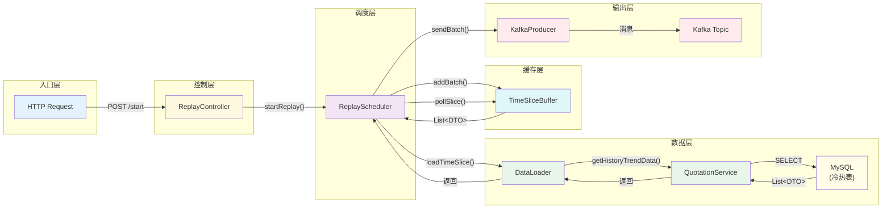
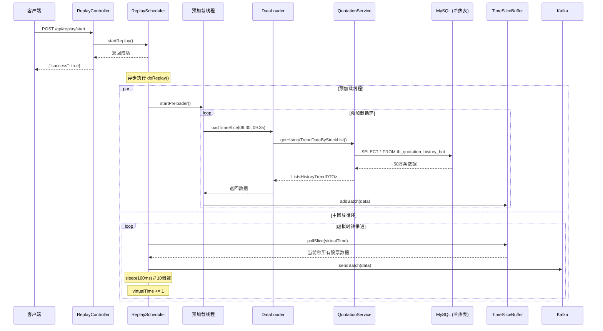

# 行情回放服务执行流程详解

本文档详细说明了 `ReplayController` 的执行流程，从 HTTP 请求到最终数据推送到 Kafka 的完整链路。

---

## 完整执行流程图

### 架构总览

```mermaid
flowchart TB
    subgraph Client["客户端"]
        A1[POST /api/replay/start]
    end
    
    subgraph Controller["ReplayController"]
        B1[接收HTTP请求]
        B2{检查config.enabled?}
        B3[调用startReplay]
        B4[返回成功响应]
    end
    
    subgraph Scheduler["ReplayScheduler"]
        C1["初始化虚拟时钟<br/>virtualTime = 09:30:00"]
        C2["启动预加载线程<br/>startPreloader()"]
        C3["等待初始数据<br/>waitForInitialData()"]
        C4{"virtualTime <= endTime?"}
        C5{"是否暂停?"}
        C6{"是否午休时间?<br/>11:30-13:00"}
        C7["从Buffer取数据<br/>pollSlice(virtualTime)"]
        C8["发送到Kafka<br/>sendToKafka()"]
        C9["速度控制休眠<br/>sleep(1000/speed)"]
        C10["时间推进<br/>virtualTime += 1"]
        C11[回放完成]
    end
    
    subgraph Preloader["预加载线程"]
        D1{"preloadCursor < endDate?"}
        D2{"缓冲区是否已满?<br/>size > bufferMaxSize"}
        D3["加载时间片数据<br/>loadTimeSlice()"]
        D4["添加到缓冲区<br/>buffer.addBatch()"]
        D5["推进游标<br/>cursor += 5min"]
        D6[预加载结束]
    end
    
    subgraph DataLoader["DataLoader"]
        E1["解析股票代码<br/>parseStockCodes()"]
        E2["调用QuotationService"]
    end
    
    subgraph QuotationService["QuotationService"]
        F1{"判断查询时间范围"}
        F2["查询热表<br/>tb_quotation_history_hot"]
        F3["查询温表<br/>tb_quotation_history_warm"]
        F4["并行查询冷热表"]
        F5[合并返回结果]
    end
    
    subgraph MySQL["MySQL 数据库"]
        G1["热表<br/>2024年及以后"]
        G2["温表<br/>2024年以前"]
    end
    
    subgraph Buffer["TimeSliceBuffer"]
        H1["TreeMap按秒分组<br/>timestamp → List"]
    end
    
    subgraph Kafka["Kafka"]
        I1["quotation Topic"]
    end
    
    %% 主流程
    A1 --> B1
    B1 --> B2
    B2 -->|No| B4
    B2 -->|Yes| B3
    B3 --> B4
    B3 -.->|@Async| C1
    
    C1 --> C2
    C2 -.-> D1
    C1 --> C3
    C3 --> C4
    C4 -->|No| C11
    C4 -->|Yes| C5
    C5 -->|Yes| C5
    C5 -->|No| C6
    C6 -->|Yes| C10
    C6 -->|No| C7
    C7 --> C8
    C8 --> C9
    C9 --> C10
    C10 --> C4
    
    %% 预加载流程
    D1 -->|No| D6
    D1 -->|Yes| D2
    D2 -->|Yes| D2
    D2 -->|No| D3
    D3 --> D4
    D4 --> D5
    D5 --> D1
    
    %% 数据加载流程
    D3 --> E1
    E1 --> E2
    E2 --> F1
    F1 -->|仅热表| F2
    F1 -->|仅温表| F3
    F1 -->|跨表| F4
    F2 --> G1
    F3 --> G2
    F4 --> G1
    F4 --> G2
    G1 --> F5
    G2 --> F5
    F5 --> E2
    
    %% 缓冲区流程
    D4 --> H1
    C7 --> H1
    
    %% Kafka发送
    C8 --> I1

    classDef clientClass fill:#e1f5fe,stroke:#01579b
    classDef controllerClass fill:#fff3e0,stroke:#e65100
    classDef schedulerClass fill:#f3e5f5,stroke:#7b1fa2
    classDef preloaderClass fill:#e8f5e9,stroke:#2e7d32
    classDef dataClass fill:#fce4ec,stroke:#c2185b
    classDef dbClass fill:#fffde7,stroke:#f57f17
    classDef bufferClass fill:#e0f2f1,stroke:#00695c
    classDef kafkaClass fill:#ffebee,stroke:#c62828
    
    class A1 clientClass
    class B1,B2,B3,B4 controllerClass
    class C1,C2,C3,C4,C5,C6,C7,C8,C9,C10,C11 schedulerClass
    class D1,D2,D3,D4,D5,D6 preloaderClass
    class E1,E2,F1,F2,F3,F4,F5 dataClass
    class G1,G2 dbClass
    class H1 bufferClass
    class I1 kafkaClass
```

### 简化调用链



---


## 一、核心组件概览

| 组件 | 职责 | 文件位置 |
|------|------|----------|
| **ReplayController** | REST API 入口，接收启动/暂停/停止等请求 | `web/controller/ReplayController.java` |
| **ReplayConfig** | 配置类，管理回放参数（日期、速度、股票代码等） | `config/ReplayConfig.java` |
| **ReplayScheduler** | 核心调度器，维护虚拟时钟，控制数据推送节奏 | `replay/ReplayScheduler.java` |
| **DataLoader** | 数据加载器，从 MySQL 批量查询历史行情 | `replay/DataLoader.java` |
| **TimeSliceBuffer** | 时间片缓冲区，按秒组织数据，支持高效检索 | `replay/TimeSliceBuffer.java` |
| **QuotationService** | 行情服务，执行冷热表分离的数据库查询 | `service/QuotationService.java` |
| **KafkaProducerService** | Kafka 生产者，发送行情消息到 `quotation` Topic | `service/KafkaProducerService.java` |

---

## 二、启动回放完整流程

### 场景：用户调用 `/api/replay/start` 启动全市场 A 股回放

**假设传入参数**（通过配置文件或 API 参数）：
- `startDate`: `20250601`
- `endDate`: `20250630`
- `speedMultiplier`: `10`（10倍速）
- `stockCodes`: 空（全市场）

---

### 步骤 1：HTTP 请求进入 ReplayController

```
POST /api/replay/start
```

**调用方法**：`ReplayController.start()`

**执行逻辑**：
```java
@PostMapping("/start")
public Map<String, Object> start() {
    // 1. 记录日志
    log.info("收到启动回放请求|Replay_start_request");
    
    // 2. 检查配置是否启用
    if (!replayConfig.isEnabled()) {
        return buildResponse(false, "回放模式未启用...");
    }
    
    // 3. 调用调度器启动回放 ← 核心调用
    replayScheduler.startReplay();
    
    return buildResponse(true, "回放已启动");
}
```

**关键点**：
- 检查 `ReplayConfig.enabled` 是否为 true
- 调用 `ReplayScheduler.startReplay()` 进入核心调度逻辑

---

### 步骤 2：ReplayScheduler 异步启动回放

**调用方法**：`ReplayScheduler.startReplay()`

**执行逻辑**：
```java
@Async("ioTaskExecutor")  // 使用 IO 线程池异步执行
public void startReplay() {
    // 1. 幂等检查：防止重复启动
    if (running.compareAndSet(false, true)) {
        try {
            doReplay();  // ← 进入主回放流程
        } finally {
            running.set(false);
        }
    }
}
```

**关键点**：
- `@Async` 注解确保不阻塞 HTTP 响应
- 使用 `AtomicBoolean` 保证只有一个回放实例运行

---

### 步骤 3：初始化时间参数

**调用方法**：`ReplayScheduler.doReplay()`（第一部分）

**执行逻辑**：
```java
private void doReplay() {
    // 1. 解析日期配置
    LocalDate startDate = LocalDate.parse(config.getStartDate(), COMPACT_FORMATTER);
    LocalDate endDate = LocalDate.parse(config.getEndDate(), COMPACT_FORMATTER);
    
    // 2. 设置股市交易时间
    LocalDateTime start = LocalDateTime.of(startDate, LocalTime.of(9, 30, 0));   // 开盘
    LocalDateTime end = LocalDateTime.of(endDate, LocalTime.of(15, 0, 0));       // 收盘
    
    // 3. 初始化虚拟时钟（北京时间戳）
    virtualTime = start.toEpochSecond(BEIJING_ZONE);  // 例如：1717217400
    preloadCursor = start;
    totalSentCount = 0;
}
```

**关键点**：
- 虚拟时钟从 `09:30:00` 开始
- 使用秒级时间戳进行时间管理

---

### 步骤 4：启动预加载线程

**调用方法**：`ReplayScheduler.startPreloader(LocalDateTime endDate)`

**执行逻辑**：
```java
private CompletableFuture<Void> startPreloader(LocalDateTime endDate) {
    return CompletableFuture.runAsync(() -> {
        while (preloadCursor.isBefore(endDate) && running.get()) {
            
            // 4.1 背压控制：缓冲区满时等待
            while (buffer.size() > config.getBufferMaxSize()) {
                sleep(500);  // 等待消费
            }
            
            // 4.2 计算预加载时间片范围
            LocalDateTime sliceEnd = preloadCursor.plusMinutes(config.getPreloadMinutes());
            
            // 4.3 调用 DataLoader 加载数据 ← 核心调用
            List<HistoryTrendDTO> data = dataLoader.loadTimeSlice(preloadCursor, sliceEnd);
            
            // 4.4 添加到缓冲区
            if (!data.isEmpty()) {
                buffer.addBatch(data);
            }
            
            // 4.5 推进预加载游标
            preloadCursor = sliceEnd;
        }
    });
}
```

**关键点**：
- 独立线程异步预加载，不阻塞主回放循环
- 背压机制防止内存溢出

---

### 步骤 5：DataLoader 从数据库加载数据

**调用方法**：`DataLoader.loadTimeSlice(LocalDateTime start, LocalDateTime end)`

**执行逻辑**：
```java
public List<HistoryTrendDTO> loadTimeSlice(LocalDateTime start, LocalDateTime end) {
    String startStr = start.format(COMPACT_FORMATTER);  // "20250601"
    String endStr = end.format(COMPACT_FORMATTER);
    
    // 5.1 解析股票代码配置
    List<String> stockList = parseStockCodes();  // 全市场时为空列表
    
    // 5.2 调用 QuotationService 查询数据库 ← 核心调用
    List<HistoryTrendDTO> data = quotationService.getHistoryTrendDataByStockList(
            startStr, endStr, stockList
    );
    
    return data;
}

private List<String> parseStockCodes() {
    if (!StringUtils.hasLength(config.getStockCodes())) {
        return Collections.emptyList();  // 全市场
    }
    return Arrays.asList(config.getStockCodes().split(","));
}
```

**关键点**：
- `stockCodes` 为空时返回空列表，表示查询全市场
- 复用现有的 `QuotationService` 冷热表分离逻辑

---

### 步骤 6：QuotationService 执行冷热表查询

**调用方法**：`QuotationServiceImpl.getHistoryTrendDataByStockList(...)`

**执行逻辑**：
```java
public List<HistoryTrendDTO> getHistoryTrendDataByStockList(
        String startDate, String endDate, List<String> stockList) {
    
    LocalDate start = LocalDate.parse(startDate, pattern);
    LocalDate end = LocalDate.parse(endDate, pattern);
    
    // 6.1 判断查询哪些表
    boolean queryWarm = start.isBefore(HOT_DATA_START_DATE);  // 2024-01-01 之前
    boolean queryHot = end.isAfter(HOT_DATA_START_DATE);      // 2024-01-01 之后
    
    // 6.2 仅查询热表
    if (queryHot && !queryWarm) {
        return quotationMapper.selectByWindCodeListAndDate(
            TABLE_HOT, startDate, endDateWithTime, stockList);
    }
    
    // 6.3 跨冷热表：并行查询
    if (queryWarm && queryHot) {
        CompletableFuture<List<HistoryTrendDTO>> warmFuture = CompletableFuture.supplyAsync(
            () -> quotationMapper.selectByWindCodeListAndDate(TABLE_WARM, ...));
        CompletableFuture<List<HistoryTrendDTO>> hotFuture = CompletableFuture.supplyAsync(
            () -> quotationMapper.selectByWindCodeListAndDate(TABLE_HOT, ...));
        
        // 合并结果
        return merge(warmFuture.get(), hotFuture.get());
    }
}
```

**关键点**：
- **热表** (`tb_quotation_history_hot`)：2024年及以后的数据
- **温表** (`tb_quotation_history_warm`)：2024年以前的数据
- 跨表查询时使用 `CompletableFuture` 并行执行

---

### 步骤 7：TimeSliceBuffer 缓存数据

**调用方法**：`TimeSliceBuffer.addBatch(List<HistoryTrendDTO> data)`

**执行逻辑**：
```java
public void addBatch(List<HistoryTrendDTO> data) {
    // 7.1 按交易时间的秒级时间戳分组
    Map<Long, List<HistoryTrendDTO>> grouped = data.stream()
        .filter(dto -> dto.getTradeDate() != null)
        .collect(Collectors.groupingBy(
            dto -> dto.getTradeDate().toEpochSecond(BEIJING_ZONE)
        ));
    
    // 7.2 加锁写入 TreeMap
    lock.writeLock().lock();
    try {
        for (Map.Entry<Long, List<HistoryTrendDTO>> entry : grouped.entrySet()) {
            Long timestamp = entry.getKey();
            List<HistoryTrendDTO> list = entry.getValue();
            
            // 使用 TreeMap 保证时间有序
            timeSlices.computeIfAbsent(timestamp, k -> new ArrayList<>())
                      .addAll(list);
        }
        totalSize.addAndGet(addedCount);
    } finally {
        lock.writeLock().unlock();
    }
}
```

**数据结构示意**：
```
TreeMap<Long, List<HistoryTrendDTO>>
├── 1717217400 (09:30:00) → [股票1数据, 股票2数据, ..., 股票5000数据]
├── 1717217401 (09:30:01) → [股票1数据, 股票2数据, ...]
├── 1717217402 (09:30:02) → [股票1数据, 股票2数据, ...]
└── ...
```

**关键点**：
- 使用 `TreeMap` 保证时间戳有序
- 读写锁保证多线程安全

---

### 步骤 8：主回放循环发送数据

**调用方法**：`ReplayScheduler.doReplay()`（第二部分：主循环）

**执行逻辑**：
```java
// 主回放循环
long endTimestamp = end.toEpochSecond(BEIJING_ZONE);

while (virtualTime <= endTimestamp && running.get()) {
    
    // 8.1 处理暂停状态
    while (paused.get() && running.get()) {
        sleep(100);
    }
    
    // 8.2 跳过非交易时间（午休 11:30-13:00）
    if (isNonTradingTime(virtualTime)) {
        virtualTime += 1;
        continue;
    }
    
    // 8.3 从缓冲区获取当前秒的数据 ← 核心调用
    List<HistoryTrendDTO> batch = buffer.pollSlice(virtualTime);
    
    // 8.4 发送到 Kafka
    if (batch != null && !batch.isEmpty()) {
        sendToKafka(batch);
        totalSentCount += batch.size();
    }
    
    // 8.5 速度控制休眠
    sleepForReplay();  // speedMultiplier=10 时休眠 100ms
    
    // 8.6 虚拟时间推进 1 秒
    virtualTime += 1;
}
```

**速度控制逻辑**：
```java
private void sleepForReplay() {
    int speed = config.getSpeedMultiplier();
    if (speed <= 0) {
        return;  // 最快速度，不休眠
    }
    long sleepMs = 1000 / speed;  // 10倍速 → 休眠100ms
    sleep(sleepMs);
}
```

---

### 步骤 9：发送数据到 Kafka

**调用方法**：`ReplayScheduler.sendToKafka(List<HistoryTrendDTO> batch)`

**执行逻辑**：
```java
private void sendToKafka(List<HistoryTrendDTO> batch) {
    String topic = KafkaTopics.QUOTATION.code();  // "quotation"
    kafkaProducer.sendBatchHighPerformance(topic, batch);
}
```

**Kafka 消息结构**：
```json
{
    "windCode": "600519.SH",
    "tradeDate": "2025-06-01T09:30:01",
    "latestPrice": 1835.50,
    "totalVolume": 12500.00,
    "averagePrice": 1834.80
}
```

---

## 三、全市场 A 股回放数据流示意



---

## 四、关键配置参数说明

在 `application.yml` 中配置：

```yaml
replay:
  enabled: true                    # 启用回放模式
  start-date: 20250601             # 回放起始日期
  end-date: 20250630               # 回放结束日期
  speed-multiplier: 10             # 倍速（0=最快，1=实时，10=10倍速）
  preload-minutes: 5               # 预加载时间片长度（分钟）
  buffer-max-size: 100000          # 缓冲区最大数据条数
  stock-codes:                     # 股票代码列表（空=全市场）
```

---

## 五、全市场数据量估算

| 指标 | 数值 |
|------|------|
| A 股总数量 | ~5000 只 |
| 每日交易时间 | 4 小时 = 14400 秒 |
| 每秒每股数据量 | 1 条 |
| **单日数据总量** | 5000 × 14400 = **7200 万条** |
| 预加载 5 分钟数据量 | 5000 × 300 = **150 万条** |

---

## 六、性能优化要点

1. **预加载与回放解耦**：独立线程并行执行，充分利用 IO 等待
2. **背压控制**：缓冲区满时暂停预加载，防止 OOM
3. **冷热表分离**：新旧数据物理隔离，优化查询性能
4. **批量 Kafka 发送**：减少网络往返次数
5. **虚拟时钟机制**：精确模拟真实市场节奏

---

## 七、API 接口汇总

| 端点 | 方法 | 描述 |
|------|------|------|
| `/api/replay/start` | POST | 使用配置文件参数启动回放 |
| `/api/replay/start-with-params` | POST | 使用请求参数覆盖配置启动 |
| `/api/replay/pause` | POST | 暂停回放 |
| `/api/replay/resume` | POST | 恢复回放 |
| `/api/replay/stop` | POST | 停止回放 |
| `/api/replay/status` | GET | 获取回放状态 |
| `/api/replay/config` | GET | 获取当前配置 |
| `/api/replay/speed?multiplier=X` | POST | 动态调整速度 |
