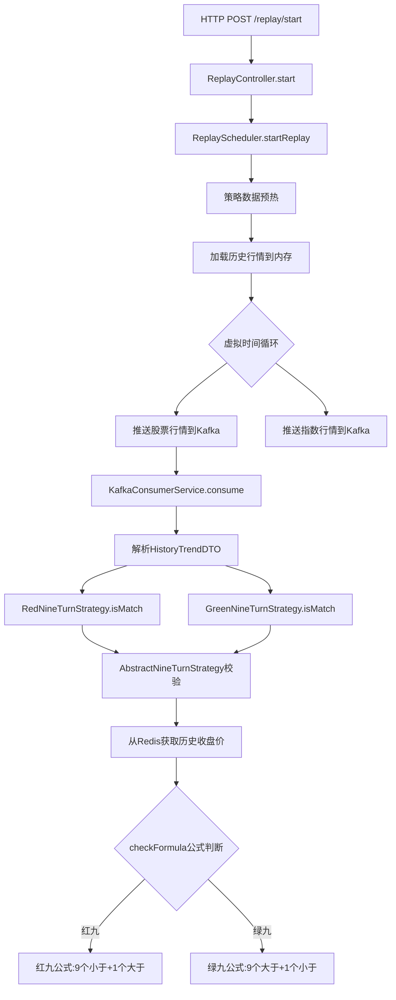

# 行情回放与九转策略完整执行流程

## 流程总览



---

## 详细断点列表

### 模块一：数据回放服务 (quant-data-collector)

| 断点 | 类.方法 | 说明 | 代码位置 |
|------|---------|------|----------|
| **TODO STOP 1** | `ReplayController.start()` | HTTP入口，收到回放启动请求 | [ReplayController.java:80](file:///e:/project/quant-nano-alpha/services/quant-data-collector/src/main/java/com/hao/datacollector/web/controller/ReplayController.java#L80) |
| **TODO STOP 2** | `ReplayScheduler.doReplay()` | 策略数据预热，预缓存九转所需历史数据到Redis | [ReplayScheduler.java:152](file:///e:/project/quant-nano-alpha/services/quant-data-collector/src/main/java/com/hao/datacollector/replay/ReplayScheduler.java#L152) |
| **TODO STOP 3** | `ReplayScheduler.doReplay()` | 从数据库加载历史行情数据到内存 | [ReplayScheduler.java:157](file:///e:/project/quant-nano-alpha/services/quant-data-collector/src/main/java/com/hao/datacollector/replay/ReplayScheduler.java#L157) |
| **TODO STOP 4** | `ReplayScheduler.doReplay()` | 推送股票行情到Kafka(quotation) | [ReplayScheduler.java:180](file:///e:/project/quant-nano-alpha/services/quant-data-collector/src/main/java/com/hao/datacollector/replay/ReplayScheduler.java#L180) |
| **TODO STOP 5** | `ReplayScheduler.doReplay()` | 推送指数行情到Kafka(quotation_index) | [ReplayScheduler.java:188](file:///e:/project/quant-nano-alpha/services/quant-data-collector/src/main/java/com/hao/datacollector/replay/ReplayScheduler.java#L188) |

---

### 模块二：策略引擎服务 (quant-strategy-engine)

| 断点 | 类.方法 | 说明 | 代码位置 |
|------|---------|------|----------|
| **TODO STOP 6** | `KafkaConsumerService.consume()` | Kafka消费入口，收到股票行情 | [KafkaConsumerService.java:94](file:///e:/project/quant-nano-alpha/services/quant-strategy-engine/src/main/java/com/hao/strategyengine/integration/kafka/KafkaConsumerService.java#L94) |
| **TODO STOP 7** | `KafkaConsumerService.consume()` | 调用红九策略判断 | [KafkaConsumerService.java:99](file:///e:/project/quant-nano-alpha/services/quant-strategy-engine/src/main/java/com/hao/strategyengine/integration/kafka/KafkaConsumerService.java#L99) |
| **TODO STOP 8** | `KafkaConsumerService.consume()` | 调用绿九策略判断 | [KafkaConsumerService.java:106](file:///e:/project/quant-nano-alpha/services/quant-strategy-engine/src/main/java/com/hao/strategyengine/integration/kafka/KafkaConsumerService.java#L106) |
| **TODO STOP 9** | `AbstractNineTurnStrategy.isMatch()` | 九转策略入口，开始校验 | [AbstractNineTurnStrategy.java:89](file:///e:/project/quant-nano-alpha/services/quant-strategy-engine/src/main/java/com/hao/strategyengine/core/stream/strategy/impl/nineturn/AbstractNineTurnStrategy.java#L89) |
| **TODO STOP 10** | `AbstractNineTurnStrategy.isMatch()` | 从Redis获取前13日收盘价 | [AbstractNineTurnStrategy.java:106](file:///e:/project/quant-nano-alpha/services/quant-strategy-engine/src/main/java/com/hao/strategyengine/core/stream/strategy/impl/nineturn/AbstractNineTurnStrategy.java#L106) |
| **TODO STOP 11** | `AbstractNineTurnStrategy.isMatch()` | 执行14日公式判断(调用子类) | [AbstractNineTurnStrategy.java:120](file:///e:/project/quant-nano-alpha/services/quant-strategy-engine/src/main/java/com/hao/strategyengine/core/stream/strategy/impl/nineturn/AbstractNineTurnStrategy.java#L120) |
| **TODO STOP 12** | `RedNineTurnStrategy.checkFormula()` | 红九公式：#1<#5...#9<#13 AND #10>#14 | [RedNineTurnStrategy.java:61](file:///e:/project/quant-nano-alpha/services/quant-strategy-engine/src/main/java/com/hao/strategyengine/core/stream/strategy/impl/nineturn/RedNineTurnStrategy.java#L61) |
| **TODO STOP 13** | `GreenNineTurnStrategy.checkFormula()` | 绿九公式：#1>#5...#9>#13 AND #10<#14 | [GreenNineTurnStrategy.java:61](file:///e:/project/quant-nano-alpha/services/quant-strategy-engine/src/main/java/com/hao/strategyengine/core/stream/strategy/impl/nineturn/GreenNineTurnStrategy.java#L61) |

---

## 调试方法

在IDE中搜索 `TODO STOP` 可快速定位所有断点位置：

```
# IntelliJ IDEA
Ctrl+Shift+F → 搜索 "TODO STOP"

# 按编号顺序打断点，完整跟踪回放→策略执行流程
```
