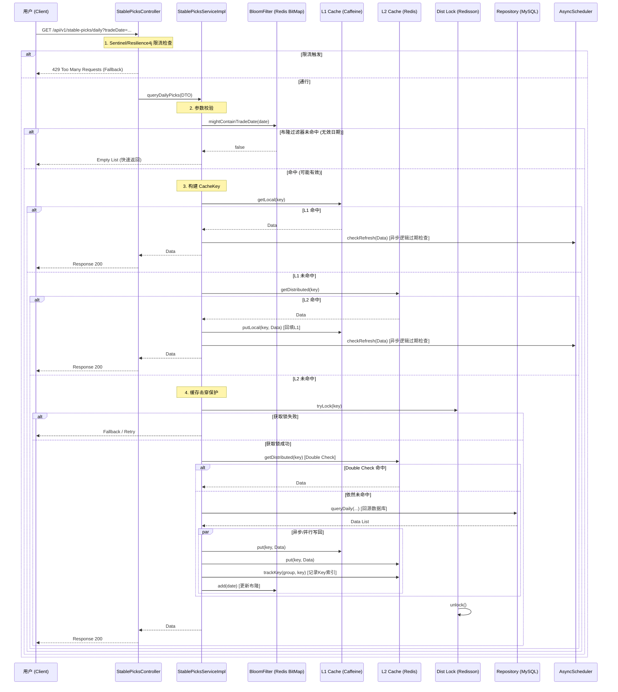

# 核心接口调用流程说明 (Call Flow Documentation)

本文档详细描述了 `quant-stock-list` 模块中“每日精选股票查询”接口的核心调用流程。该流程设计遵循高并发读场景下的多级缓存与防御策略。

## 1. 核心流程概览 (Overview)

用户请求进入系统后，依次经过以下防御层：
1.  **限流层 (Rate Limiter)**: 保护服务不被突发流量打垮。
2.  **布隆过滤器 (Bloom Filter)**: 快速拦截无效日期的请求，防止缓存穿透。
3.  **L1 本地缓存 (Caffeine)**: 极速响应，承担大部分热点流量。
4.  **L2 分布式缓存 (Redis)**: 共享缓存，解决实例间数据一致性。
5.  **分布式锁 (Redisson)**: 防止缓存击穿（Cache Stampede）。
6.  **数据库 (MySQL)**: 最终数据源。

## 2. 详细调用流程图 (Flow Chart)

## 3. 关键类与方法说明 (Class & Method Details)

### 3.1 Controller 层
*   **类**: `StablePicksController`
*   **方法**: `queryDailyPicks`
*   **作用**:
    *   作为流量入口，定义了 API 契约。
    *   使用 `@RateLimiter` 注解进行限流保护。
    *   定义了 `fallbackMethod`，当请求过多时直接返回友好提示，不再向下调用。

### 3.2 Service 层 (核心编排)
*   **类**: `StablePicksServiceImpl`
*   **方法**: `queryDailyPicks` & `queryWithCache` (模板方法)
*   **作用**:
    *   **布隆过滤**: 调用 `bloomFilter.mightContainTradeDate`。这是第一道高效防线，如果是查询 "2099-01-01" 这种不存在的数据，在这里直接返回空，绝不查库。
    *   **多级缓存模板**: `queryWithCache` 封装了 "查L1 -> 查L2 -> 加锁 -> 查库 -> 回写" 的标准逻辑。
    *   **逻辑过期 (Logical Expiry)**: 代码中通过 `CacheWrapper` 判断数据是否“软过期”。如果软过期，直接返回旧数据给用户，同时在后台线程池 (`stablePicksScheduler`) 异步触发一次刷新。这是实现“高可用”的关键，避免用户请求被慢SQL阻塞。

### 3.3 Infrastructure 层 (基础设施)
*   **类**: `StablePicksCacheRepository`
*   **作用**:
    *   屏蔽了 Caffeine 和 Redis 的 API 差异。
    *   **新增特性**: 实现了 `trackKeyInGroup` 和 `clearGroup`。这是为了解决 Redis `KEYS` 命令的性能问题。每次写入缓存时，将 Key 加入一个 Set 集合；清理时直接读取该 Set 进行删除。

*   **类**: `StrategyResultEventListener`
*   **作用**:
    *   监听 Kafka 消息（策略计算完成）。
    *   一旦策略更新，调用 `cacheRepository.clearGroup` 精确清理相关缓存。
    *   保证了数据的一致性（虽然是最终一致性，但延迟极低）。

## 4. 为什么这么设计？ (Design Rationale)

1.  **为什么不直接查 Redis?**
    *   Redis 也有性能上限（网络带宽、序列化开销）。万级并发下，L1 本地缓存（Caffeine）能处理掉 80%-90% 的请求，只有少量请求透传到 Redis，极大保护了 Redis 集群。

2.  **为什么要用分布式锁?**
    *   当热点 Key 突然失效（TTL 到期），如果没有锁，瞬时可能有 1000 个请求同时打到数据库（Cache Stampede），直接导致数据库宕机。分布式锁保证同一时刻只有一个线程去查库，其他线程等待或直接返回降级数据。

3.  **为什么要记录 Key 到 Set 中?**
    *   为了支持高效的批量删除。直接使用 `keys *` 命令在生产环境（特别是 Redis Cluster）是禁用的，会导致 Redis 阻塞。通过维护一个索引 Set，删除操作的时间复杂度变为 O(1) 或 O(N)，且不会阻塞主线程。
